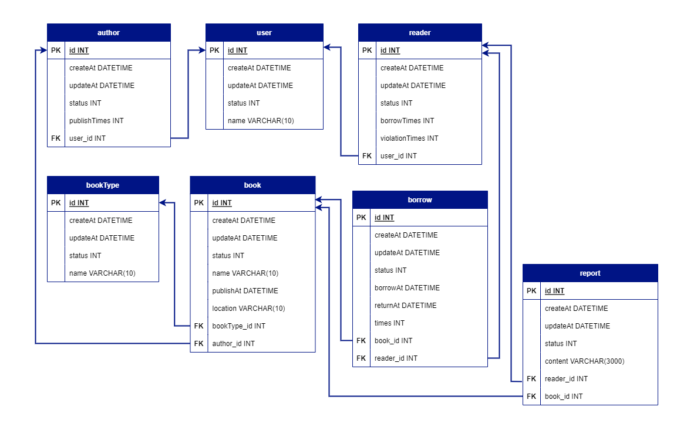

# Library API

## Overview

- Language: Python v3.9.15
- Web FrameWork: Django v4.2.6

## ENV

copy `.env.example` as `.env`

```
DB_HOST="127.0.0.1"
DB_PORT="3306"
DB_USER="root"
DB_PASSWORD="password"
DB_NAME="database"

SECRET_KEY="django123456789#@?-key"
DEBUG="True"
```

## Run

### migration

```
python manage.py migrate
```

### server

```
python manage.py runserver
```

## ER Diagram


## API

### user

- POST /user : 新增使用者
- GET /user : 取得所有生效的使用者
- DELETE /user/{user_id} : 停用使用者

### author

- POST /author : 新增作者，不帶使用者 id 時則一併新增使用者
- GET /author : 取得所有生效的作者
- DELETE /author/{author_id} : 停用作者

### reader

- POST /reader : 新增讀者，不帶使用者 id 時則一併新增使用者
- GET /reader : 取得所有生效的讀者
- DELETE /reader/{reader_id} : 停用讀者

### book_type

- POST /book_type : 新增書本類型
- GET /book_type : 取得所有生效的書本類型
- DELETE /book_type/{bookTypeId} : 停用書本類型

### book

- POST /book : 新增書本
- GET /book : 取得所有生效的書本
- DELETE /book/{book_id} : 停用書本

### borrow, renew, return

- POST /borrow/{book_id}/{reader_id} : 借書, 書本的狀態改為停用, 一次借書30天
- POST /renew/{book_id}/{reader_id} : 續借, 最多續借2次
- POST /return/{book_id}/{reader_id} : 還書, 超時會被記錄違規次數

### report

- POST /report : 新增心得
- GET /report : 取得所有生效的心得
- PATCH /report : 更新心得內文
- DELETE /report/{report_id} : 停用心得

### rank

- POST /rank/borrow_times : 取得讀者借書次數排名
- POST /rank/violation_times : 取得讀者違規次數排名
- POST /rank/publish_times : 取得作者出版次數排名

## Custom Error Code

In bookapp/view

```
SUCCESSFUL = 0
INVALID_API = 117
INVALID_PARAMETER = 118
INSUFFICIENT_PARAMETER = 119
OVER_BORROW_TIMES_LIMIT = 120
```
